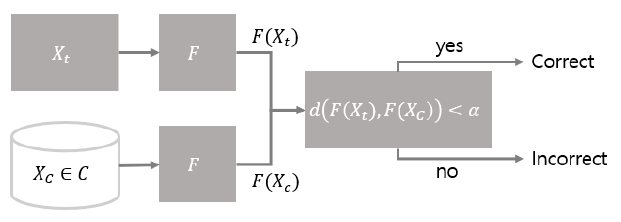
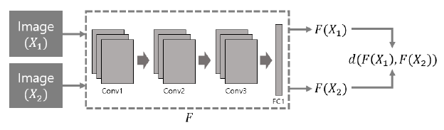
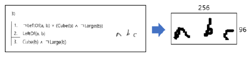
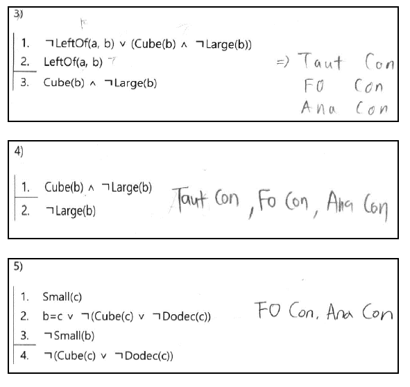
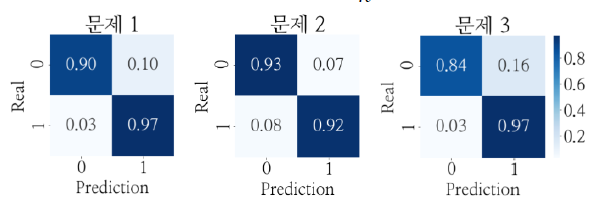

# Auto-Grading-System-for-Hand-Written-Answer-Sheet

2019 한국정보과학회 KCC 논문

수기 답안지 자동 채점 시스템

## 개요

수기로 답안이 작성된 시험지를 채점할 때 효율성을 높이기 위해 답안들의 유사성을 계산해 답안이 유사한 시험지끼리 군집화하는 것을 목적으로 함

Siamese CNN을 사용해 수기로 작성된 단답형 답안들의 거리를 계산함

저장되어 있는 기존의 정답 답안들, $$X_c$$와 채점할 답안 $$X_t$$의 거리를 계산

정답 답안들과의 거리를 계산해 정렬하면 정답 답안과 비슷한 답안들을 추출할 수 있음

실험에서는 성능 측정을 위해 계산한 거리가 threshold $$\alpha$$보다 작으면 맞은 답안, 크면 틀린 답안으로 미채점 답안을 분류해서 모델의 정확도를 평가

## 모델

모델의 구조는 Siamese 구조에 CNN을 결합한 형태

모델의 입력으로 한 쌍의 이미지를 받고 같은 네트워크를 통과시켜서 얻은 값으로 거리를 계산

## 데이터 전처리

시험지 이미지에서 OCR(Optical character recognition)을 사용해 답안 부분만을 추출한 후에 이미지 크기를 $$256\times 96$$으로 조정

## 모델 성능

일반적인 경우의 성능 검증을 위해 수집한 288개의 이미지를 222개의 학습 데이터와 66개의 테스트 데이터로 나눔

학습 데이터는 118개의 정답 데이터와 104개의 오답 데이터로 이루어져 있고 이를 무작위로 3000개의 쌍으로 만들어 학습에 사용

이와 같은 방법으로 10-fold cross-validation을 써서 모델의 일반적 성능을 검증

학습된 모델에 테스트 데이터를 입력으로 주고 학습 데이터로 사용했던 정답 이미지들과의 거리를 측정해 정답인지 오답인지 분류

세 종류의 문제에 대해 각 실제 정답 중 97%, 92%, 97%를 정답으로 분류했고, 실제 오답 중 90%, 93%, 84%를 오답으로 분류

## 참고

학습 & 모델 평가에 사용한 데이터는 실제 시험지의 답안인 관계로 공개하지 않음

본 프로젝트에서 사용한 OCR 모델은 [여기](https://github.com/Breta01/handwriting-ocr)를 참조